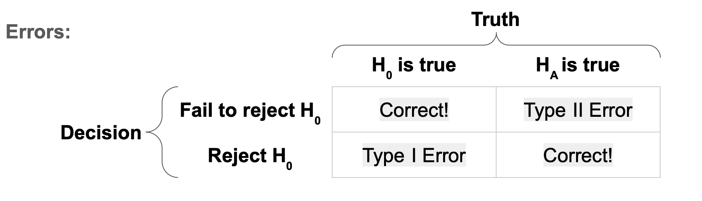
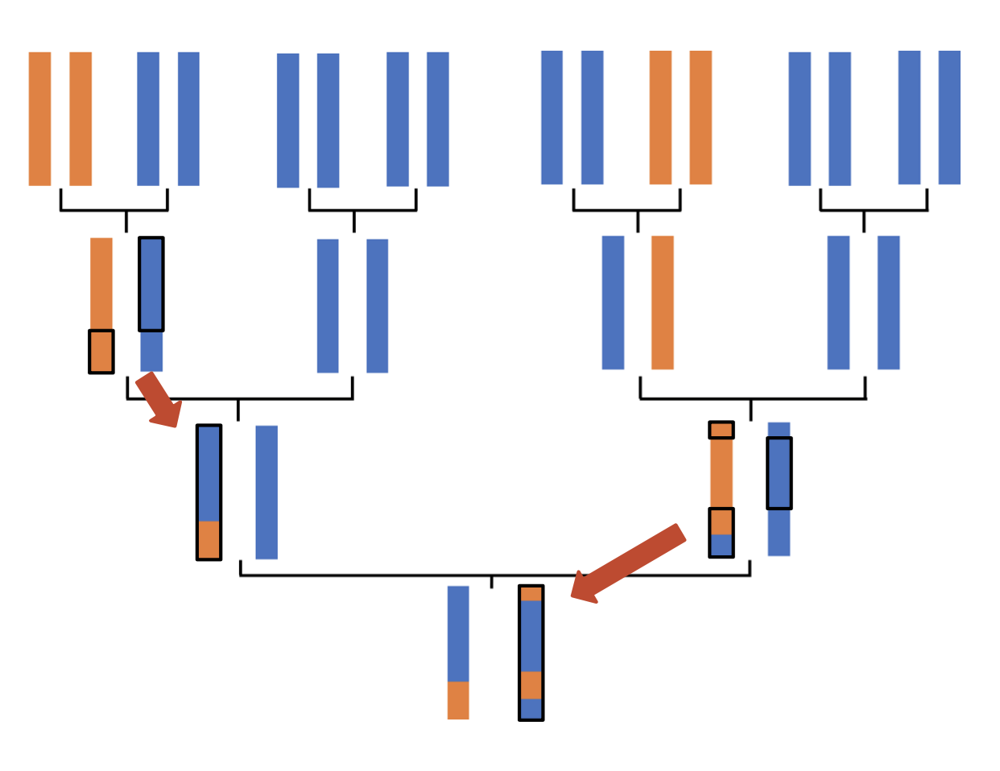
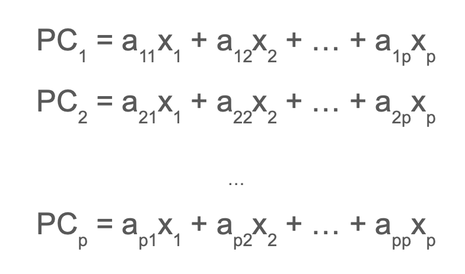

```{r setup, include=FALSE}
knitr::opts_chunk$set(echo = TRUE)

htmltools::img(src = knitr::image_uri("Errors.png"), 
               alt = 'Table Displaying Type 1 and Type 2 Errors', 
               style = 'float: right;padding-right:10px;height:125px;width:250px')

htmltools::img(src = knitr::image_uri("Recombination.png"), 
               alt = 'Example of Recombination Event', 
               style = 'float: right;padding-right:10px;height:125px;width:250px')

htmltools::img(src = knitr::image_uri("PCA.png"), 
               alt = 'logo', 
               style = 'float: right;padding-right:10px;height:125px;width:250px')
```

## Introduction

Often when we work with genetic data, our goal when running models is to find the SNPs with the smallest p-values. This allows us to find SNPs of significance that may give us insight into which SNPs affect certain traits. However, there are many factors that can make this process much more complicated and need to be accounted for. In this article, we will go over two of these factors: conducting multiple hypothesis tests and genetic ancestry.

## Hypothesis Testing

We determine whether a SNP is small enough to be statistically significant through a process called hypothesis testing. The goal of hypothesis testing is to help us decide between two conflicting theories, the null hypothesis and the alternative hypothesis. In general, the null hypothesis suggests that there is no relationship between the variable being tested and the output. The alternative suggests that there is a relationship between the variable being tested and the output. In the case of genetic data, our null hypothesis is that there is no relationship between the trait we are interested in and the current SNP being tested. The alternative hypothesis states that there is a relationship between the trait and the SNP. But how do we decide which one is true?

We use p-values to determine how significant the relationship between the explanatory variable and the output is. Larger p-values indicate less significant or no relationship and smaller p-values indicate more significance. However, what it large and small is totally relative. So we must choose a threshold for our p-values to be larger or smaller than to determine significance. This chosen value is arbitrary but commonly a threshold of 0.05 is used to test whether a variable is significant or not. Using a threshold of 0.05, any value above 0.05 would not be considered significant and any value below would be considered significant. As values get closer 0.05, the interpretation of what is significant and what isn't can become a little bit more complex. For example, is there is really a difference in significance for variables with p-values between 0.049 and 0.051? Arguably not and some researchers use terms like 'borderline significant' to refer to p-values that are close to the threshold though the concept of what is close or not is also fairly subjective. However, for now, we will follow the general rule that any p-value larger than the threshold is not significant and any p-value smaller than the threshold is significant.

### P-Values

What is a p-value? When conducting hypothesis tests, there are 4 types of results we can get. Firstly, we can fail to reject the null hypothesis when the null is true. We can also reject the null hypothesis when the alternative is true. Both of these are good results as we decided on the course of action that was aligned with the truth. However, it should be noted, that when working with real data, we will most likely not know the truth. There are also two types of errors that can occur. A Type I error occurs when we reject the null hypothesis and say that the relationship between a variable and the output is significant when actually, the null hypothesis is true and there is no relationship. A Type II error occurs when we fail to reject the null hypothesis and say that the relationship is not significant when there is actually a significant relationship. A p-value is the probability of obtaining results at least as extreme as the observed ones. To determine which p-values we consider significant, we choose a threshold oftentimes labeled $\alpha$. This is also equal to probability of making a Type I error. So with a p-value threshold of 0.05, we are allowing there to be a 5% chance that we make a Type I error. Ideally, we would like to minimize error as much as possible. However, aggressively minimizing one type of error can lead to increases in the probability of the other type of error occurring so a balance must be found depending on how concerned we are with each error type.



## Multiple Testing

When we work with genetic data, we will have to conduct a hypothesis test for every SNP. For each *independent* hypothesis test, there will be a 5% chance that we make a Type I error. This begs the question, what is the probability of making a Type I error across all the tests? If we conducted 10 independent tests at a threshold of 0.05 then we can determine the probability of making at least 1 Type I error across all the tests from the following equation:

$P(\text{at least 1 T1E}) = 1 - [1 - 0.05]^{10} \cong 0.4$

More generally, we can view this equation like the following, where $\alpha$ is our desired Type I error rate and $m$ is the number of hypothesis tests we are conducting:

$P(\text{at least 1 T1E}) = 1 - [1 - \alpha]^m$

To get the probability of getting at least 1 Type I error we can start by getting the probability of *not* getting a Type I error which is $1-0.05$. Since we did 10 tests, we multiply the probability of not getting a Type I error for each test with each other, which was accomplished with the exponent of 10 since the probability is the same for all 10 tests, to get the probability of not getting a Type I error across all tests. We then take 1 - P(not getting a Type I error across all tests) in order to get the probability of getting at least 1 Type I error across all tests. At a threshold of 0.05 for each *independent* hypothesis test, our probability of getting at least 1 Type I error across all tests, otherwise known as **family-wise error rate** (**FWER**), is .4 which means that there is a 40% chance that at least 1 Type I error will occur. This is much higher than our desired chance of 5%. This signifies that we need to make our p-value threshold smaller for the individual tests so that our family-wise error rate is reasonable. But how small should we make them?

### Bonferroni Correction

There are several ways to approach this question but one very common method is known as the **Bonferroni Correction**. The Bonferroni Correction states that we can calculate the significance threshold of the individual hypothesis tests by dividing our desired family-wise error rate by the number of hypothesis tests. To make that a little bit more visual, if $\alpha$ is our desired FWER and $m$ is the number of hypothesis tests we are conducting then our new significance threshold is:

$\frac{\alpha}{m}$

So if we desired a FWER of 0.05 and we were conducting 10 hypothesis tests, our new significance threshold under the Bonferroni correction would be:

$\frac{0.05}{10} = .005$

We can prove that this method works mathematically using Boole's Inequality. As stated above, FWER is the probability of making at least one Type I error. Therefore, FWER is the probability of rejecting at least 1 true null hypothesis. We can write that probability like so:

$P(\bigcup_{i=1}^{m_0}(p_i \leq \frac{\alpha}{m}))$

where $m$ is the number of hypotheses being tested, $m_0$ is the number of true null hypotheses, $\alpha$ is our desired significance threshold, and $p_i$ is the associated p-value for each hypothesis test. The large union bound $\bigcup$ is used to show the union between multiple events, in this case, hypothesis tests from 1 to $m_0$. Boole's inequality states that

$P(\bigcup_{i=1}^{n} A_i \leq \sum_{i=1}^n P(A_i)$.

We can prove this statement through induction. Since

$P(A \cup B) = P(A) + P(B) - P(A \cap B)$,

let's say

$P(\bigcup_{i=1}^{n+1} A_i) = P(\bigcup_{i=1}^n A_i) + P(A_{n+1}) - P(\bigcup_{i=1}^n A_i \cap A_{n+1})$

Since all probabilities must be greater than equal to 0, we know that

$P(\bigcup_{i=1}^{n+1} A_i) \leq P(\bigcup_{i=1}^n A_i) + P(A_{n+1})$

since we are no longer taking away a number that must be 0 or positive.

$P(\bigcup_{i=1}^{n+1} A_i) \leq \sum_{i=1}^n P(A_i) + P(A_{n+1}) = \sum_{i=1}^{n+1} P(A_i)$

Now that we know Boole's Inequality is true, let's use it to prove the Bonferroni Correction.

$P(\bigcup_{i=1}^{m_0}(p_i \leq \frac{\alpha}{m})) \leq \sum_{i=1}^{m_0} (p_i \leq \frac{\alpha}{m})) = m_0\frac{\alpha}{m}$

Since we will not know how many true null hypotheses there are, we assume that the null hypothesis is always true. This means we can write the above statement as

$P(\bigcup_{i=1}^{m}(p_i \leq \frac{\alpha}{m})) \leq \sum_{i=1}^{m} (p_i \leq \frac{\alpha}{m})) = m\frac{\alpha}{m} = \alpha$.

However, this method only works well when conducting multiple independent hypothesis tests. When data is correlated, as it often is in genetic data, then the Bonferoni Correction can be overly conservative in its calculation of the significance threshold. In other words, the significance threshold is smaller than it needs to be which, as mentioned before, reduces the chance even further of having a Type I error but increases the chance of having Type II errors. So instead, we need a method that only divides our desired family-wise error rate by the number of *independent* hypothesis tests being conducted.

### Simulation Based Approach

Another approach to multiple testing is a simulation based approach. This approach involves simulating a null trait which is a trait that is not associated with any of the SNPs. Then we run GWAS to test the association between the trait the SNPs and record the smallest p-value. This process is repeated many, many times and then look at all the smallest p-values we saved over every replication of the simulation and find the lowest 5th percentile. This value will become our new p-value threshold. This method will work even if tests are correlated unlike the Bonferroni Correction. However, it is computationally expensive.

In order to help us understand this method in more depth, we will be running through some code using some data from [this Github page](https://github.com/MareesAT/GWA_tutorial/) specifically from the 1_QC_GWAS file.

In order to use the `snpStats` library, run the following code in the console to install it:

```         
if (!require("BiocManager", quietly = TRUE))
    install.packages("BiocManager")
BiocManager::install("snpStats")
```

The `NatParksPalettes` package is not necessary but gives us some fun colors to work with.

```{r}
library(broom)
library(snpStats)
library(NatParksPalettes)
```

We need the fam, bim, and bed files to make sure our data looks right. To reduce the computational expense, we will only be looking at the first 100 SNPs.

```{r read-hapmap-data}
# update these file paths according to the way you've stored the data on your computer
fam <- 'HapMap_3_r3_1.fam'
bim <- 'HapMap_3_r3_1.bim'
bed <- 'HapMap_3_r3_1.bed'

# then read in the files, using select.snps to select only the first 100
hapmap <- read.plink(bed, bim, fam, select.snps = 1:100)

# confirm we have 100 SNPs only
hapmap$genotypes
```

There are some monomorphic SNPs in this dataset which we need to remove. Monomorphic SNPs occur when no one in the dataset has the minor allele. These SNPs do not provide any information to us since they are the same for everyone so we remove them.

```{r}
maf <- col.summary(hapmap$genotypes)$MAF
mono <- which(maf == 0)
```

In statistical genetics, we refer to correlation between SNPs as linkage disequilibrium (LD) and we can use the `ld` function in the snpStats package that we can use to calculate the LD for us.

```{r calculate-hapmap-ld}
# calculate LD
hapmap.ld <- ld(hapmap$genotypes[,-mono], depth = 99-length(mono), stats = "R.squared", symmetric = TRUE)
```

We can use square brackets to define a 5-by-5 matrix to take a look at the first few results of our LD.

```{r plot-hapmap-ld}
# look at the first 5-by-5 elements:
hapmap.ld[1:5, 1:5]
```

In this matrix, values closer to one indicate higher correlation. For example, rs3131972, rs3131969, and rs1048488 are all highly correlated with each other.

We can also use the `image` function to plot our LD.

```{r}
# plot LD (grey scale)
image(hapmap.ld)

# plot LD (fun color palette)
color.pal <- natparks.pals("Acadia", 10)
image(hapmap.ld, lwd = 0, cuts = 9, col.regions = color.pal, colorkey = TRUE)
```

In this plot, the blocks are colored by how correlated that SNP is with another. Colors associated with 1 indicate that the SNP is completely correlated with another while colors associated with 0 indicate that the SNP is completely independent from other SNPs. However, it should be noted that SNPs can be correlated even if linkage disequilibrium is equal to 0 if the relationship between the SNPs is non-linear.

Based on the plot above, we can see that there are several SNPs that are highly correlated with each other.

In order to make our data easier to work with, we can use the `as` function with the parameter "numeric" to create a matrix of zeroes, ones, and twos representing the minor allele frequency.

```{r convert-genotype-data}
hapmap.geno <- as(hapmap$genotypes, "numeric")
```

Once again, we must remove the monomorphic SNPs. In order to make sure we have done this correctly, we can check the dimensions of the matrix before and after filtering the monomorphic SNPs out.

```{r remove-monomorphic}
# check the dimensions before filtering
dim(hapmap.geno)

# filter genotype matrix to remove monomorphic SNPs
hapmap.geno <- hapmap.geno[,-mono]

# check the dimensions after filtering
dim(hapmap.geno)
```

In order to run our simulation, we can define a function that simulates one null trait $y$ and then run GWAS with this null trait. We then find the smallest p-value using the `min` function and that is recorded as the output of the function.

```{r get-significance-threshold}
# write a function to do one simulation replicate
do_one_sim_hapmap <- function(){
  # simulate null trait
  y <- rnorm(n = 165, mean = 0, sd = 1)
  # implement GWAS
  pvals <- c()
  for(i in 1:83){
    mod <- lm(y ~ hapmap.geno[,i])
    pvals[i] <- tidy(mod)$p.value[2]
  }
  # check if any pvals are < 0.05
  min(pvals)
}
```

We then want to run this function several times, in this case 500 times. Since we are generating a random null trait, we set a seed to make sure that each time this code is run, we get the same random null trait. This is very important because if we didn't do this, our results would different every time we run our code. The number within the set.seed function does not matter as long as it stays the same every time you run your code.

```{r, cache=TRUE}
# then repeat many times
set.seed(494)
hapreps <- replicate(500, do_one_sim_hapmap())

# then use the quantile function to find the lower 5th percentile
quantile(hapreps, probs = c(.05))
```

The `quantile` function provides us with the percentile of the lower 5% of our simulated p-values. The Bonferroni Correction threshold would be

$0.05/83 = .0006024096$

which is much smaller than our simulation approach threshold. This threshold would make it much more difficult to reject the null hypothesis which in turn could result in more type 2 errors.

## Genetic Ancestry

Genetic ancestry refers to the ancestral origin the genetic material we inherit. This differs from genealogical ancestry which is defined more in terms of someone's family tree rather than their DNA. For example, I might say that I am 1/4 Italian since one of my grandparents was Italian and an immigrant from Italy. However, according to my genetics, I might not actually have 1/4 of my grandparent's genetic material. This is because as genes are passed on from one generation to another, recombination events (see bottom right of below image) occur that shuffle the genetic material that is passed on. This is why siblings have the same genealogical ancestry but not the same genetic ancestry.



Genetic ancestry is especially important to us when studying methods to analyze our genome since it can be a confounding factor. A confounding factor is a variable, typically unmeasured, which can influence predictors and outcomes. This means it will be correlated to a predictor variable and causally related to the dependent variable. In this case, genetic ancestry can be correlated to genotype since our ancestors influence what genes we get. This will also affect what traits we have. In order to account for genetic ancestry in GWAS, we can add it to our general model.

However, before we can account for genetic ancestry, we need to infer what someone's genetic ancestry is first. There are several methods to infer genetic ancestry that include both machine learning techniques as well as biologically informed model based approaches. Here, we will focus on one unsupervised machine learning technique: **Principal Component Analysis**.

## PCA

Principal Component Analysis (PCA) is an unsupervised learning machine learning tool that focuses on dimension reduction. It is unsupervised because it does not require outcome values or labels. This means that everything generated by PCA is based purely on the covariates. PCA returns linear combinations of our original variables that are called principal components (PCs). These PCs are generated based on which ones explain the most variability in the data. For example, to generate PC1, all possible linear combinations of the original variables are considered and the one with the most variance is labeled as the first principal component PC1. PC2 will be the linear combination that has the next largest variance given that it is perpendicular or orthogonal to PC1. This process then continues for all other PCs.



The values that our PCs take are called scores. The coefficients ($a$ in above image) of the linear combination within the PCs are called loadings.

### Running PCA in R

We can use R to illustrate and run the PCA process. Let's start by loading in some packages that we will need.

```{r load-packages}
library(readr)
library(ggplot2)
library(dplyr)
library(purrr)
library(GGally)
library(gridExtra)
```

I will be using a simulated 'toy' dataset to be demonstrating PCA on. These types of datasets can be really helpful both to confirm to ourselves that the method works and that our code works. This particular dataset has 1000 people in it and 15 SNPs. There are 2 population groups with 500 people in each group. What we also know, because this a simulated dataset, is that the trait depends on the genotype in SNP 3.

```{r read-data}
Toy <- read_csv("pca_toy_data.csv")
```

First, let's take a look at the minor allele frequencies for this dataset.

```{r}
Toy %>% 
  group_by(population) %>% 
  summarise_all(function(x) sum(x)/(2*length(x)))
```

What should stand out immediately is the extreme difference in minor allele frequencies in SNPs 1 and 2 where no one has the minor allele in population 1 and everyone has it in population 2. We can also see that the minor allele is more frequent in population 2 in SNPs 3-5.

Since PCA is an unsupervised learning tool, we need to remove any label variables from our dataset. We can use the select function from the `dplyr` package and use the '-' symbol within the function to indicate which columns we want to remove.

```{r pca-setup}
geno <- Toy %>% 
  select(-population, -trait)
```

We then can use the `prcomp` function to run PCA. Note that this is not the only way to run PCA in R.

```{r run-pca}
pca_out <- prcomp(geno, center = TRUE, scale = TRUE)
```

In order to assist with further analysis, we can extract the loadings and scores from our PCs with the following code. The '\$' symbol allows us to select one column from the pca_out data frame we created in the previous chunk and the `as.data.frame` function puts these columns into their own data frame.

```{r extract-scores-and-loadings}
pca_loadings <- as.data.frame(pca_out$rotation)

pca_scores <- as.data.frame(pca_out$x)
```

The plot below displays our PC scores for PC1 and PC2. We can see that PC1 divides the data into 2 separate populations.

```{r plot-scores}
pca_scores %>%
  as.data.frame() %>% # convert pca_scores into a data frame for plotting
  ggplot(aes(x = PC1, y = PC2, color = factor(Toy$population))) + # then plot
  geom_point() + 
  scale_color_viridis_d() +
  labs(color = "Population") + 
  theme_classic()
```

Another way we can plot scores is a parallel coordinates plot. This plot allows us to visualize all of our PCs at once. In the plot below, we have used color to differentiate between the two populations with each line tracing the scores of each PC for each person in the dataset. While these types of plots can get quite messy, essentially what we are looking for is when the lines for each group separate. The separation indicates that the PC is capturing population membership. In this specific plot, we can see this separation occur in PC1 and PC15 though the latter result should probably be looked at with more scrutiny.

```{r parallel-coordinates}
# parallel coordinates plot
pca_scores %>%
  as.data.frame() %>%
  mutate(population = as.factor(Toy$population)) %>% 
  ggparcoord(columns = 1:15, groupColumn = 'population', alpha = 0.2) + 
  theme_minimal() + 
  scale_color_brewer(palette = 'Dark2')
```

Another way to visualize the results of PCA is by plotting the loadings. Here, we can create an index variable to represent the SNPs (which are now the rows) so that we can use a point plot as our visualization. This way we can easily see what the values of the loadings are for each SNP. We create the index variable by adding it to the `pca_loadings` dataframe with the `mutate` function from `dplyr` and setting that variable equal to a sequence created from the `seq_len` function which is as long as the number of rows in `pca_loadings` which is obtained through the `nrow` function.

```{r plot-PC1-loadings}
pca_loadings %>%
  as.data.frame() %>%
  mutate(index = seq_len(nrow(pca_loadings))) %>%
  ggplot(aes(x = index, y = PC1)) + 
  geom_point() + 
  theme_minimal()
```

From the plot above, we can see that the first two SNPs have the highest loadings and SNPs 6-15 have loadings that are almost 0. SNPs 3-5 have loadings smaller than the first 2 SNPs but still fairly bigger than the rest of the SNPs. This makes sense since these are the SNPs with major differences in minor allele frequency between the two populations.

```{r plot-other-loadings}
p1 <- pca_loadings %>%
  as.data.frame() %>%
  mutate(index = seq_len(nrow(pca_loadings))) %>%
  ggplot(aes(x = index, y = PC2)) + 
  geom_point() + 
  theme_minimal()

p2 <- pca_loadings %>%
  as.data.frame() %>%
  mutate(index = seq_len(nrow(pca_loadings))) %>%
  ggplot(aes(x = index, y = PC3)) + 
  geom_point() + 
  theme_minimal()

p3 <- pca_loadings %>%
  as.data.frame() %>%
  mutate(index = seq_len(nrow(pca_loadings))) %>%
  ggplot(aes(x = index, y = PC4)) + 
  geom_point() + 
  theme_minimal()

grid.arrange(p1, p2, p3, ncol = 1)
```

In these plots we really don't see as much of a pattern in terms of which SNPs have more weight than others.

We can also view the PCs through the amount of variance they explain. While we know that PC1 explains the most variance overall, we don't know exactly how much it explains in relation with the other PCs. We can view this by calculating the proportion of variance each PC explains and plotting the results on what it is known as a scree plot. First, we can obtain the variance for each PC by squaring the standard deviation since each PC is a linear combination.

```{r}
# extract variance of each PC
pca_var <- (pca_out$sdev)^2
```

To create the proportion, we need to sum over the variation of each PC to get the total PC and then divide the individual variance of each PC by the total variation.

```{r}
# calculate proportion of variance explained
total_var <- sum(pca_var)
pve <- pca_var/total_var
```

This gives us a percentage that we can plot against the number of each PC which another index variable will help us do.

```{r}
# scree plot
pve %>%
  as.data.frame() %>%
  mutate(index = seq_len(length(pca_var))) %>%
  ggplot(aes(x = index, y = pve)) + 
  geom_point() + 
  geom_line() + 
  theme_minimal()
```

This plot illustrates that PC1 explains over 15% of the variance, PCs 2-14 explain approximately between 5% and 7% and PC15 explains essentially 0% of the variance, confirming our skepticism of the results from the parallel coordinates plot from earlier. The way in which scree plots can help us is by giving us an idea of how many PCs we want to include in a GWAS. We can do this through the "elbow" method which is when we look for the point at which the plot begins to flatten (the elbow) and use all PCs prior to that point. In this case, the elbow is at PC2 and so we would only want to include PC1 in our GWAS.

### Adjusting for PCs in GWAS

To illustrate the effect of adjusting for PCs in GWAS, we are going to compare an unadjusted GWAS and an adjusted GWAS. Most of this code should be understandable if you are familiar with running GWAS in R.

```{r}
# empty vector to store p-values
pvals <- c()

# loop through the 15 SNPs
for(i in 1:15){
  dat <- Toy %>% select(trait, paste0('SNP',i)) # pull out just the trait and SNP of interest
  mod <- lm(trait ~ ., data = dat) # regress trait on everything else (.), which is just SNP i in this case
  pvals[i] <- summary(mod)$coef[2,4] # pull out the p-value for the slope
}

# plot -log10 pvalues
data.frame(p = pvals, SNP = 1:15) %>%
  ggplot(aes(y = -log10(p), x = SNP)) + 
  geom_point() + 
  theme_minimal() + 
  ggtitle('Unadjusted Analysis')
```

From this plot, we can see that SNP 3 has the smallest p-value and SNPs 1 and 2 have relatively small p-values compared to the rest of the SNPs but not nearly as small as SNP 3. Now, let's look at the affect of adjusting for PC1 in GWAS.

```{r}
# empty vector to store p-values
pvals <- c()

# loop through the 15 SNPs
for(i in 1:15){
  dat <- Toy %>% 
    select(trait, paste0('SNP',i)) %>% # pull out just the trait and SNP of interest
    mutate(PC1 = pca_scores[,1]) # add the scores for PC1
  mod <- lm(trait ~ ., data = dat) # regress trait on everything else (.), which is SNP i and PC1
  pvals[i] <- summary(mod)$coef[2,4] # pull out the p-value for the slope
}

# plot -log10 pvalues
data.frame(p = pvals, SNP = 1:15) %>%
  ggplot(aes(y = -log10(p), x = SNP)) + 
  geom_point() + 
  theme_minimal() + 
  ggtitle('Adjusted Analysis')
```

We can see that this model is clearly better, only highlighting SNP 3 as having a low p-value. Since we know that SNP 3 has the genotype that the trait is based on, we can tell that this model is better because it accounts for the strong association with the trait displayed by SNPs 1 and 2 because of population. By accounting for population with PC1, SNPs 1 and 2, correctly do not have a strong association with the trait because in reality, only SNP 3 should have a strong association with the trait.
